A full stack application using Spring Boot, Angular and MySQL. 
* This is a Library Management System with an Admin and a User side for the application. 
* Admin can perform CRUD with books/users. 
* User can borrow and return a book. 
* Uses JWT to authenticate login.
* Uses BCryptPasswordEncoder to encrypt the password stored in the database.
* Redirects to forbidden page if a role doesn't have access to the url.
<br>

# APIs

## Authenticate
* Post Mapping to return JWT.
```
{
    username: "user",
    password: "password"
}
```

## Book
* Get Mapping to find all books in the database.
* Get Mapping to find book by id provided.
* Post Mapping to create book.
```
{
    "bookName": "Book Name",
    "bookAuthor": "Author Name",
    "bookGenre": "Genre",
    "noOfCopies": 5
}
```
* Put Mapping to edit book.
```
{
    "bookName": "New Book Name",
    "bookAuthor": "Author Name",
    "bookGenre": "Genre",
    "noOfCopies": 7
}
```
* Delete Mapping to delete a book.

## User
* Get Mapping to find all users in the database.
* Get Mapping to find user by id provided.
* Post Mapping to create user.
```
{
    "username": "user",
    "name": "First User",
    "password": "password",
    "role": [
        {
            "roleName": "Admin"
        }
    ]
}
```
* Put Mapping to edit user.
```
{
    "username": "user",
    "name": "New First User",
    "password": "password",
    "role": [
        {
            "roleName": "User"
        }
    ]
}
```

## Borrow
* Get Mapping to find all transactions taken place.
* Get Mapping to find list of books borrowed by a user.
* Get Mapping to find list of users who have borrowed a particular book.
* Post Mapping to borrow a book.
```
{
    "bookId": 3,
    "userId": 5
}
```
* Post Mapping to return a book.
```
{
    "borrowId": 1
}
```

<br>

# Screenshots

## Home & Login
### Home
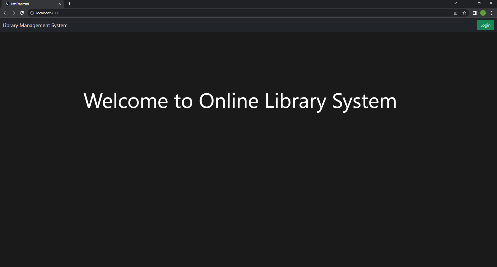

### Login
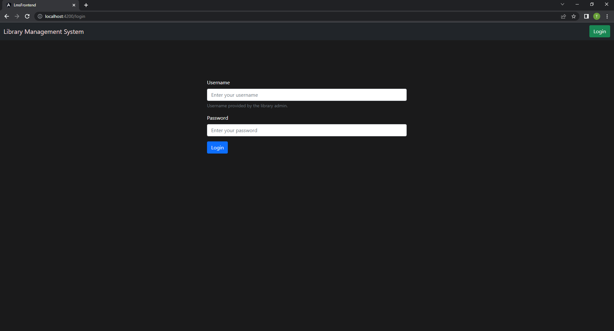

## Admin
### All books present
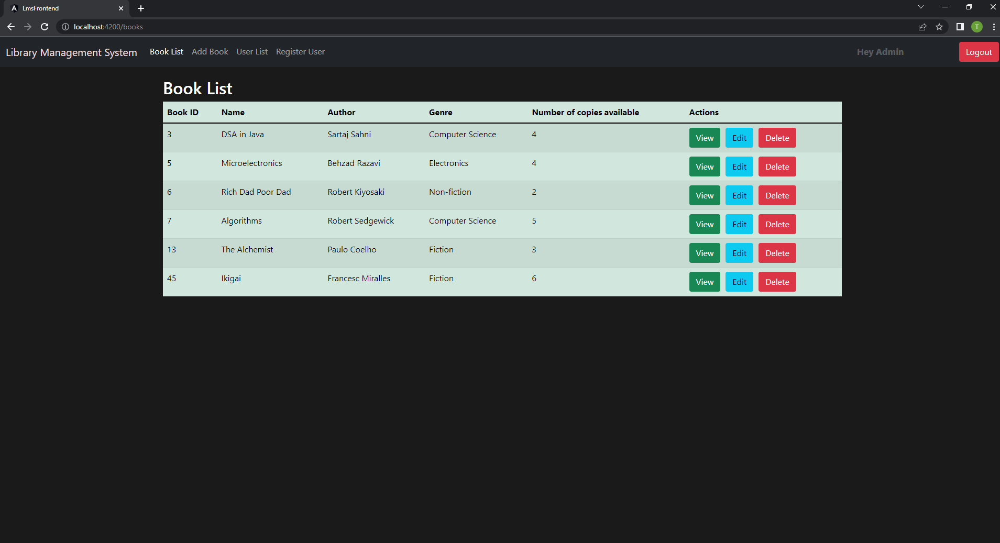

### Adding a book
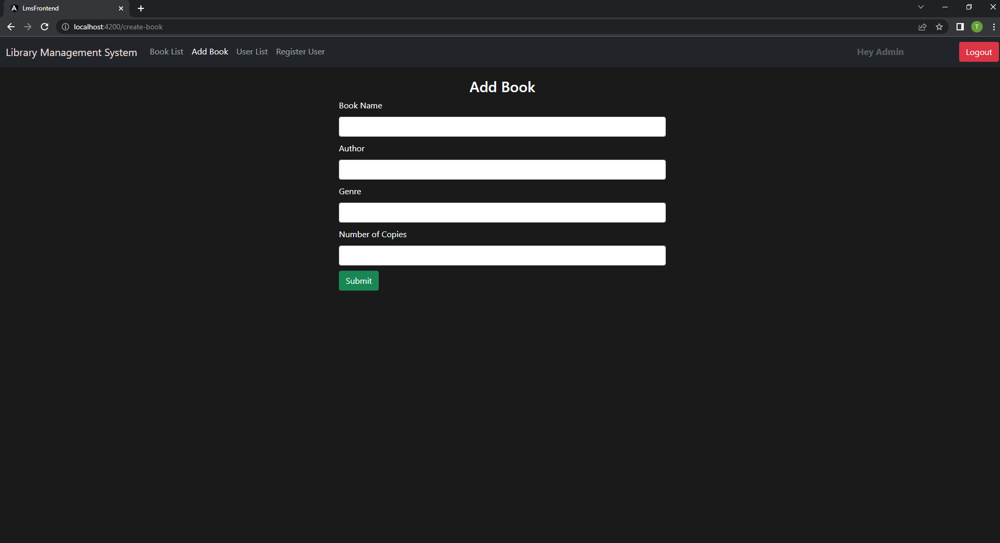

### Updating book details
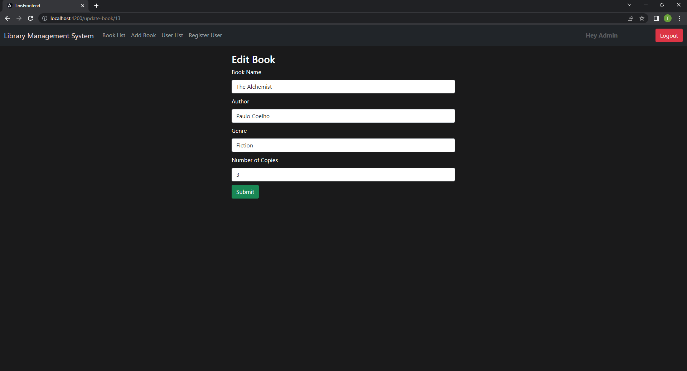

### Borrow history of a book
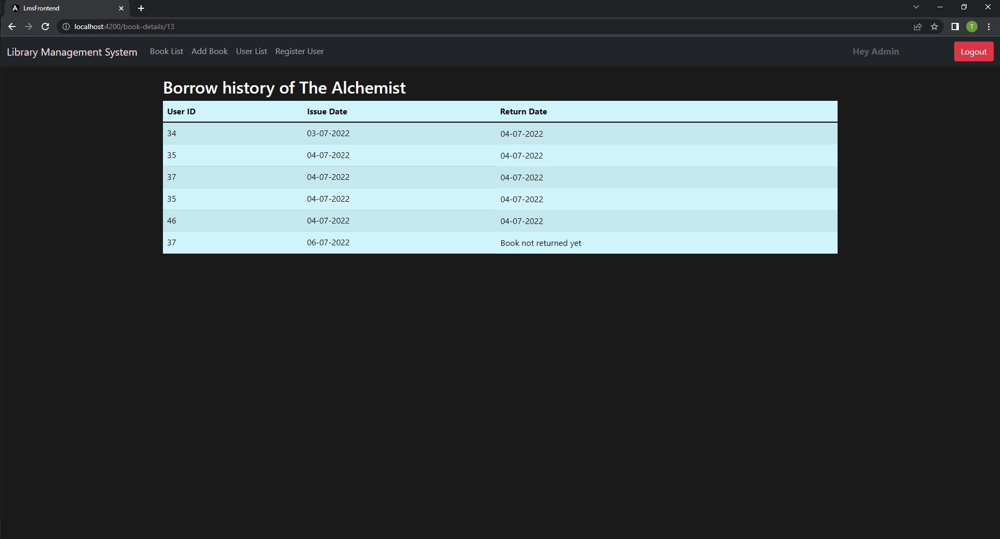

### All users present
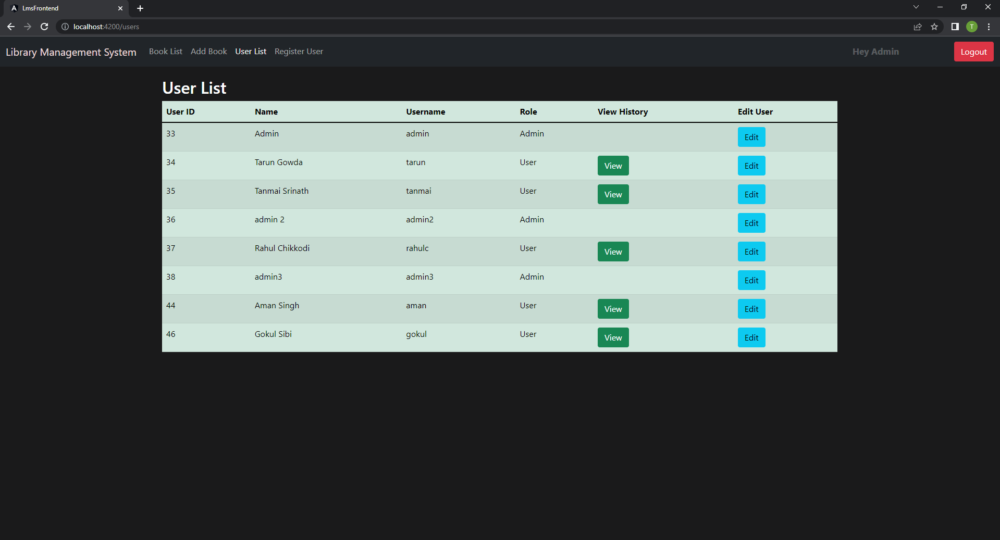

### Adding a user
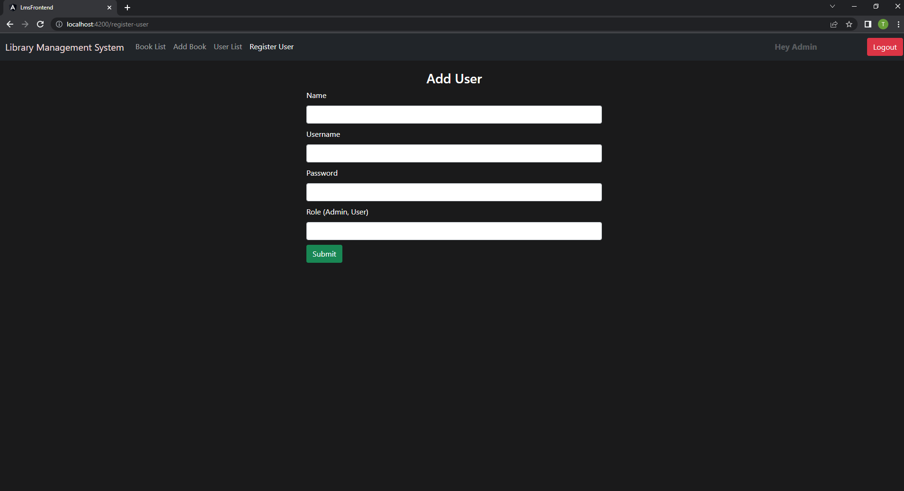

### Borrow history to the user
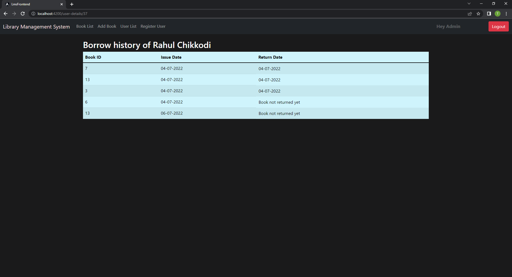

## User
### Borrow book
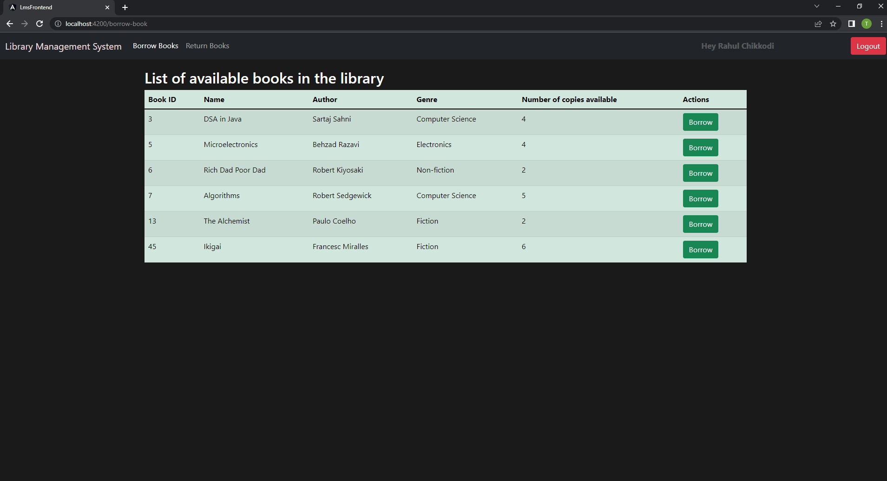

### Return book
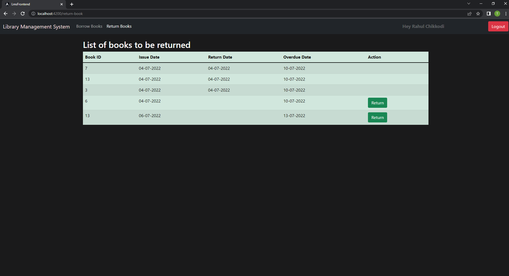

### Forbidden
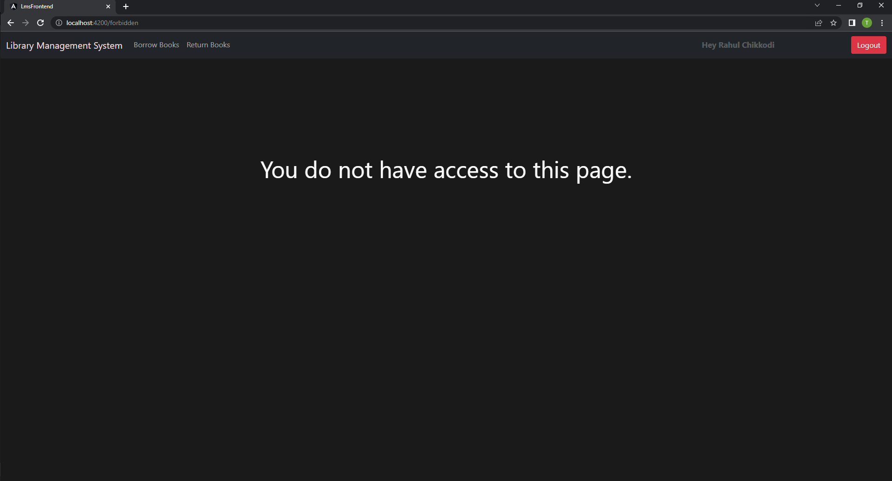

<br>

# Application Properties
```
server.port = yourPreferredPortNumber

spring.datasource.url = jdbc:mysql://localhost:3306/yourSchemaName
spring.datasource.username = yourUsername
spring.datasource.password = yourPassword
```

# Development
* Frontend
```
npm install
```
* Backend
```
mvn install
```

# Build
* Frontend
```
ng serve
```

* Backend
```
mvn spring-boot:run
```